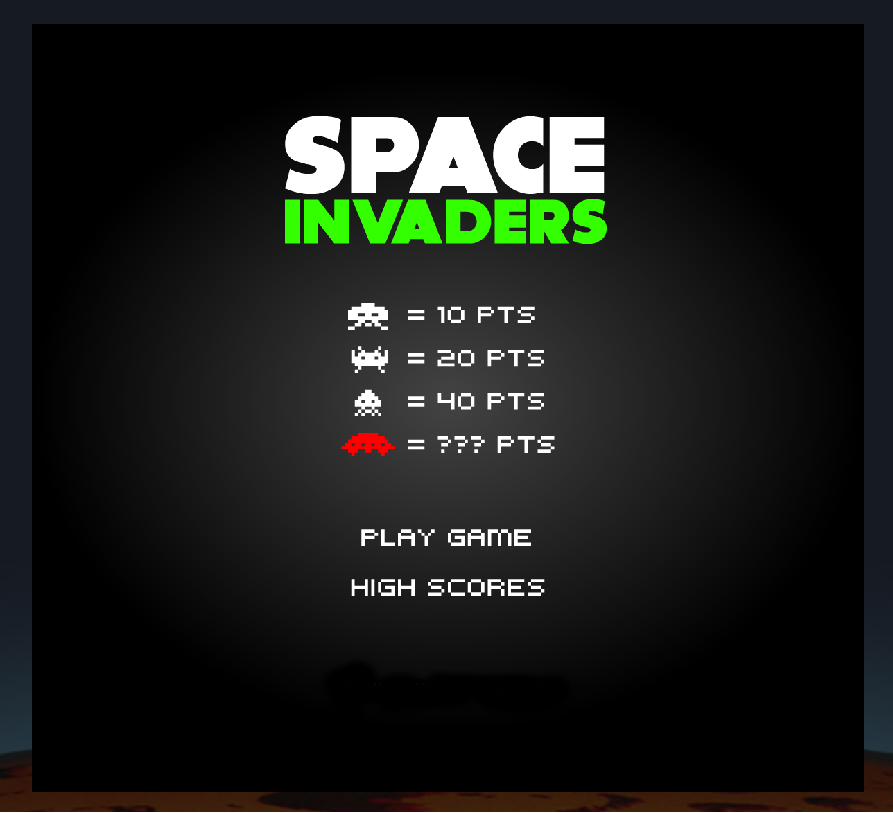

## Space Invaders

### Background

You are Earths' last hope. Created by Tomohiro Nishikado and released in 1978. Space Invaders was originally manufactured and sold by Taito in Japan. The object of the game is to shoot the invaders with your laser base while avoiding their shots and preventing an invasion. Each game screen starts with 5 rows of 11 invaders. The bottom 2 rows score 10 points per large invader, the middle 2 rows 20 points for each medium invader, and the top row scores 30 points for each small invader. This makes for a total of 990 points. The score for each screen can be increased by destroying the 'mystery' spaceships that fly from one side of the screen to the other. Temporary sanctuary can be sought beneath the 4 base shelters.

### Functionality & MVP  

This version of Space Invaders will allow users to:

- [ ] Move horizontally to dodge enemy fire and fire at opponents
- [ ] See invaders move faster as their numbers dwindle
- [ ] Feature actual sound effects and sprites from the original game
- [ ] A lives system that increases and decreases with level completion and death

In addition, this project will include:

- [ ] A high score board with saved name state
- [ ] A production README

### Wireframes

This app will consist of a single screen with game board, game controls, and nav links to the Github, my LinkedIn,
and the About modal.  Game controls will include left and right and "a" and "d" keys for direction movement for laser base and "spacebar" for firing. Center screen will feature a play game and high score buttons.

### Architecture and Technologies

This project will be implemented with the following technologies:

- `JavaScript` for game logic,
- `HTML` with `CSS` for design,
- `Canvas` for rendering effects.

There will be two primary folders one to hold assets(audio & images) and the other for game logic:

`board.js`: this script will handle the logic for creating and updating the necessary elements and rendering them to the DOM.

`invader.js`: this script will handle the logic involving invader movement and attacks. Invaders start as a grid of 5 rows and 11 columns.

`player.js`: handles logic with event handlers for player movement and attacks.

### Implementation Timeline

**Day 1**: Setup all necessary modules, webpack, and learn canvas. Write basic entry file and the outline of all 3 scripts. Goals for the day:

- Render invaders and laser base

**Day 2**: Build Invaders grid, give them attack and move speed logic. Goals for the day:

- Invaders move faster as their numbers decrease
- Add mystery ship
- Invaders change direction and move closer to bottom of board

**Day 3**: Add point system for destroying enemies. Add lives system for player. Save scores and render high score board on game end. Player can hide behind bases. Goals for the day:

- Game can be reset upon loss
- High scores last as long as game is played
- Bases disintegrate upon hit.

**Day 4**: Install the controls for the user to interact with the game.  Style the frontend, making it polished and professional. Add sound effects. Goals for the day:

- Add difficulty settings
- Allow for varied/animated backgrounds
- Allow for multiple color schemes
- Enemies have multiple attacks

### Bonus features

- [ ] Add Two Players
- [ ] New Enemy types
- [ ] Play as Invaders (gasp!)
